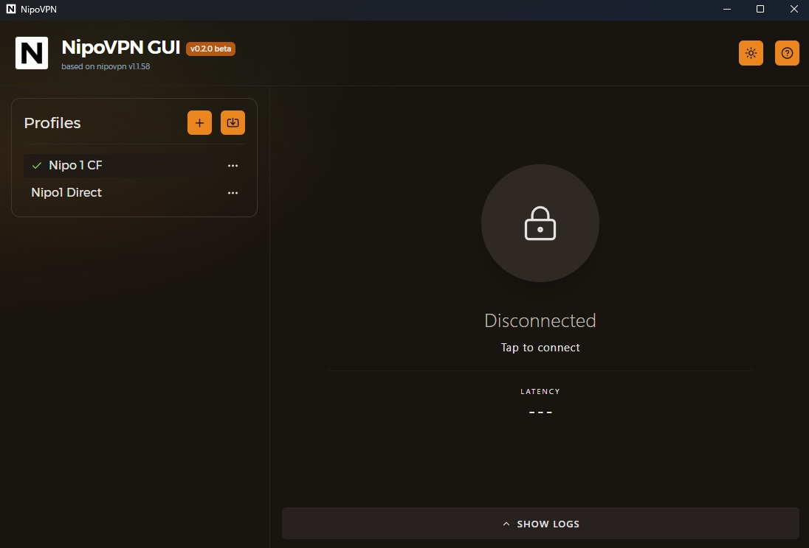
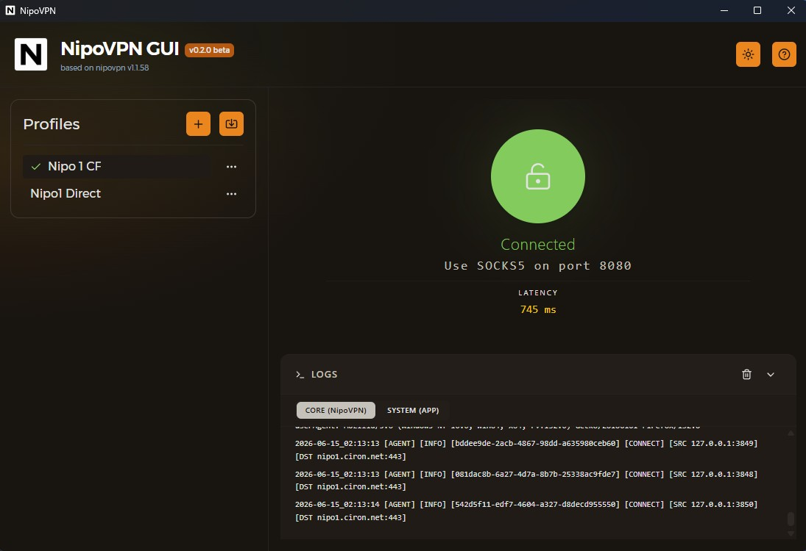
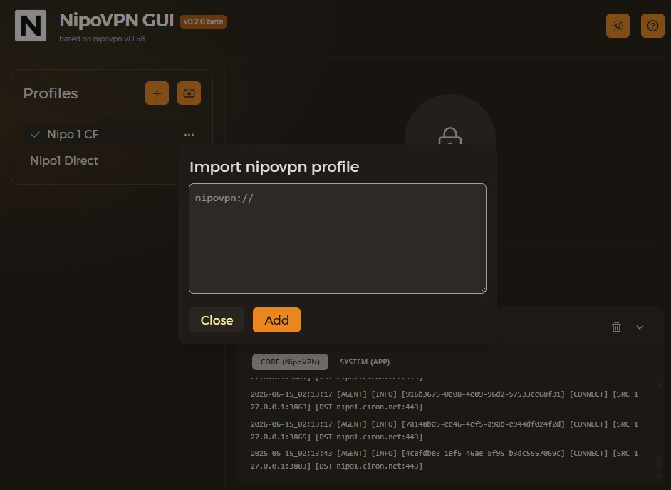
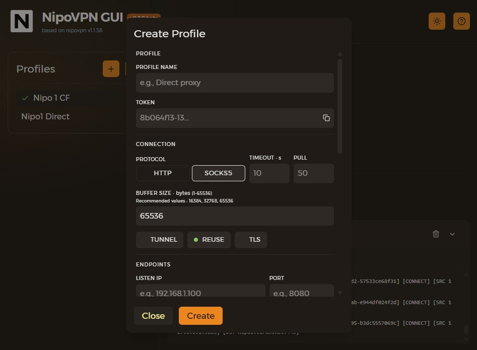

# 🚀 NipoVPN GUI

This project is a GUI for [NipoVPN](https://github.com/MortezaBashsiz/nipovpn). The core engine is NipoVPN by MortezaBashsiz.

> A modern, cross-platform desktop application for seamless VPN profile management and real-time connection monitoring

NipoVPN GUI is a sleek desktop client built with Svelte and Tauri that provides an intuitive interface for managing VPN configurations. It features comprehensive profile management, real-time latency monitoring, and detailed logging capabilities, making it easy to connect to various proxy servers with support for HTTP and SOCKS5 protocols.

## ✨ Features
- **VPN Profile Management**: Create, edit, delete, and organize multiple VPN configurations
- **Connection Control**: One-click connect/disconnect with real-time status updates
- **Latency Monitoring**: Live ping measurements for connected profiles (HTTP/SOCKS5)
- **Log Viewer**: Real-time VPN log display with clear functionality
- **Profile Import/Export**: Share and import profiles with ease
- **Windows Support**: Windows compatibility via Tauri
- **Dark Mode**: Built-in theme toggle for comfortable viewing

## 🛠️ Tech Stack


- **Frontend:** Svelte 5, SvelteKit, TypeScript, TailwindCSS
- **Backend:** Tauri (Rust-based desktop runtime)
- **UI Framework:** Skeleton
- **Icons:** Lucide Svelte

## 🖼️ Screenshots

<table>
  <tr>
    <td></td>
    <td></td>
  </tr>
  <tr>
    <td></td>
    <td></td>
  </tr>
</table>

## 🚀 Getting Started

### For Users

Download the latest release from the [Releases](https://github.com/Ar4mus/NipoVPN-GUI/releases) page.

### v0.2.0-beta Downloads

- [Portable ZIP](https://github.com/Ar4mus/NipoVPN-GUI/releases/download/v0.2.0-beta/nipovpn-gui_0.2.0_x64-Portable.zip)
- [Windows Installer EXE](https://github.com/Ar4mus/NipoVPN-GUI/releases/download/v0.2.0-beta/nipovpn-gui_0.2.0_x64-setup.exe)
- [Windows MSI Installer](https://github.com/Ar4mus/NipoVPN-GUI/releases/download/v0.2.0-beta/nipovpn-gui_0.2.0_x64_en-US.msi)

- **Installer version**: Download and install it like a normal Windows application.
- **Portable version**: Download the ZIP file and run the app without installation.

No Node.js, Rust, or Cargo installation is required to use the released application.

#### 🚀 Usage

1. **Install or extract the application**
   - If you downloaded the installer version, run the installer and continue with the default installation steps.
   - If you downloaded the portable version, extract the ZIP file and run the application directly.
2. **Launch the application**
3. **Create or import a profile**
   - Click the `+` button to add a new profile
   - Or use the Import button to paste a `nipovpn://` profile code
4. **Configure your VPN settings**
   - Protocol: HTTP or SOCKS5
   - Listen Port: Local proxy port
   - Server details and authentication
5. **Connect**
   - Select your profile from the sidebar
   - Click the lock button to establish connection
6. **Monitor**
   - View real-time latency in the main panel
   - Check logs for connection details

### For Developers

#### Prerequisites

- Node.js v18+
- Rust
- Cargo

#### Installation & Setup

1. Clone the repository:

```bash
git clone https://github.com/Ar4mus/NipoVPN-GUI.git
```

2. Navigate to the project directory:

```bash
cd nipovpn-gui
```

3. Install dependencies:

```bash
npm install
```

4. Run the application:

```bash
npm run dev-tauri
```

For development (web only):

```bash
npm run dev
```

#### Building

```bash
# Build for production
npm run build

# Create distributable packages
npm run tauri build
```

## 🗺️ Roadmap

- [ ] Production deployment setup
- [ ] Add comprehensive Unit Tests
- [ ] Auto-update functionality
- [ ] Connection statistics dashboard

## 🤝 Contributing

Contributions are welcome! Please feel free to submit a Pull Request.

- Fork the Project
- Create your Feature Branch (`git checkout -b feature/AmazingFeature`)
- Commit your Changes (`git commit -m 'Add some AmazingFeature'`)
- Push to the Branch (`git push origin feature/AmazingFeature`)
- Open a Pull Request

## 📄 License

Distributed under the MIT License. See LICENSE for more information.

## 🙏 Acknowledgments

- [NipoVPN](https://github.com/MortezaBashsiz/nipovpn) by [Morteza Bashsiz](https://github.com/MortezaBashsiz) - Core VPN engine
- [Tauri](https://tauri.app/) - For the amazing desktop framework
- [Svelte](https://svelte.dev/) - For the reactive UI framework

## 📬 Contact & Support

- **Issues**: [GitHub Issues](https://github.com/Ar4mus/NipoVPN-GUI/issues)
- **Telegram**: [@SattarBayat](https://t.me/SattarBayat)
- **Discussions**: [GitHub Discussions](https://github.com/Ar4mus/NipoVPN-GUI/discussions)